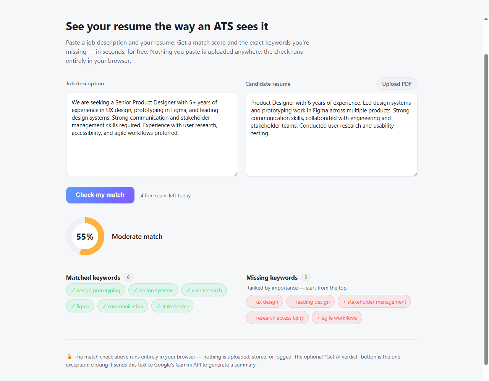

# Gudanah ATS Match Checker

A free, single-page tool: paste a job description and a resume, get an
ATS-style keyword match score plus a ranked list of missing keywords to add.
The keyword-matching core runs entirely in your browser — nothing is
uploaded, stored, or logged.

Live at [gudanah.com](https://gudanah.com) — the first tool in what will
become a small hub of free, browser-only tools under the same site.



## Features

- Paste a job description + resume, or upload a resume PDF (parsed
  client-side, never uploaded)
- Keyword match score with matched/missing keyword breakdown, ranked by
  importance
- Optional "Get AI verdict" — a short recruiter-facing summary generated by
  Google Gemini, only sent when explicitly clicked (see [Privacy](#privacy))
- No accounts, no build step, no framework — open `public/index.html` and
  it works
- A small visit counter in the header (Workers KV, no per-visitor data)

## Privacy

Your resume and job description text never leave your browser, except the
optional **Get AI verdict** button: clicking it sends that text to a
minimal Cloudflare Worker proxy, which forwards it to Google's Gemini API
and returns a short summary. This is disclosed on the button itself.
Separately, loading the page pings a visit counter — no resume/JD text, no
personal data, just a shared number incrementing by one. See
[`DOCUMENTATION.md`](DOCUMENTATION.md) for the full design rationale.

## Running locally

No build step for the static files:

- Open `public/index.html` directly in a browser (the visit counter won't
  work standalone like this — it needs the Worker), or
- Run `npx wrangler dev` from the repo root for the full thing, assets and
  `/api/visits` counter included, backed by local-only KV.

The "Get AI verdict" button stays hidden until `AI_VERDICT_ENDPOINT` in
`app.js` points at a deployed Worker — see
[`worker/README.md`](worker/README.md) for that setup (requires your own
free Cloudflare + Gemini accounts).

## Deploying

Live at gudanah.com via a Cloudflare Worker (`gudanahats`) that serves
`public/` as static assets and handles one dynamic route (`/api/visits`)
— not Cloudflare Pages (the domain's DNS is a Workers Custom Domain
binding, created before this repo existed, so the Worker path was simpler
than fighting that). To redeploy after a change:

```
./deploy.sh
```

This just runs `wrangler deploy`, which reads `wrangler.toml` at the repo
root (assets directory `public/`, KV binding for the counter). Requires
`wrangler login` once first (opens a browser to authorize).

## Project docs

- [`DOCUMENTATION.md`](DOCUMENTATION.md) — what this is, how the matching
  algorithm works, site structure, and the plan for adding more tools later
- [`GUIDELINES.md`](GUIDELINES.md) — hard scope constraints for this
  project (read before adding a feature)
- [`worker/README.md`](worker/README.md) — deploying the AI Verdict proxy

## Contributing

Issues and PRs are welcome. Please read `GUIDELINES.md` first — this
project deliberately avoids a backend, a build step, and paid/gated
third-party services outside the one sanctioned exception documented there.

## License

[MIT](LICENSE)
